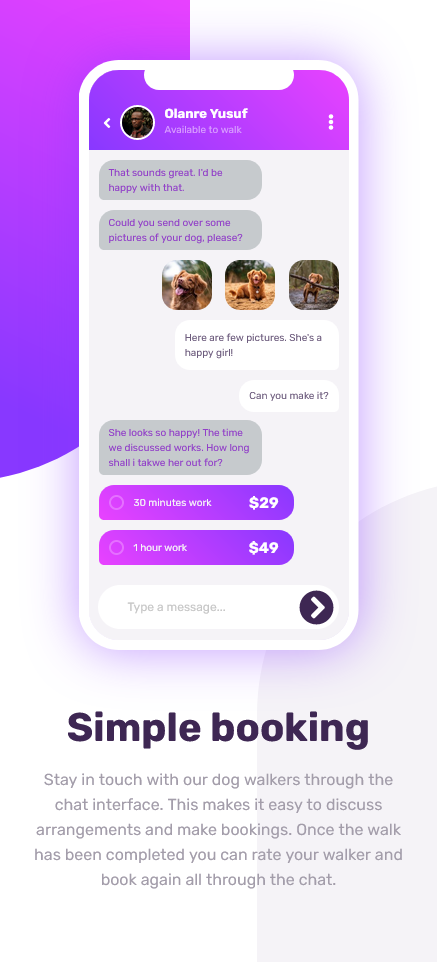
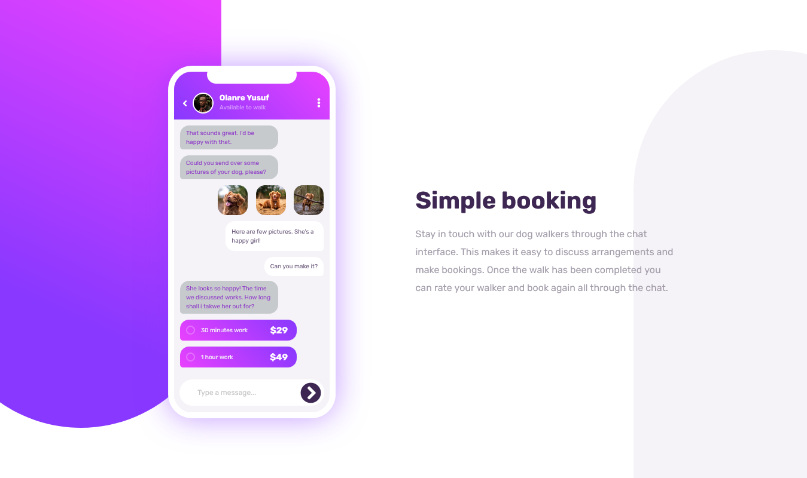

## Overview

Chat app CSS illustration coding challenge

### The challenge

Users can be able to:

- View the optimal layout for the component depending on their device's screen size
- **Bonus**: See the chat interface animate on the initial load

### Screenshot

### Links

- Solution URL: [Add solution URL here](https://your-solution-url.com)
- Live Site URL: [Add live site URL here](https://your-live-site-url.com)

## My process

Bulding this Chat-Illustration app from scartch with HTML and CSS

### Built with

- Semantic HTML5 markup
- CSS custom properties
- Flexbox
- CSS Grid
- Mobile-first workflow

### What I learned

Getting better in styling the app

### Continued development

As we always strive to get better, we normally learn something in the process

## Author

- Designer - [Waliyyullah Olanrewaju Yusuf](olanrewajuyusuf280@gmail.com)
- Frontend Mentor - [@yourusername](https://www.frontendmentor.io/profile/yourusername)
- Twitter - [@yourusername](https://www.twitter.com/yourusername)

## Acknowledgments

To frontend mentor all the time, one million thanks...
